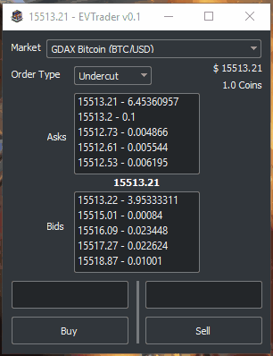

# EVTrader v0.1

#### Description
A QT5 App to automate Cryptocurrency trading, using PyQt5 and BitcoinExchangeFH library

#### Dependencies
```
pip install BitcoinExchangeFH
pip install PyQt5
pip install zmq
pip install gdax
```
#### Ways to run
1) You can simply double click the `EVTrader.lnk` shortcut in the base repository. 
2) You can copy or the `EVTrader.lnk` shortcut to your desktop so you can start the program from there. 
3) You can start the program by executing the `EVTrader.bat` which subsequently does the following below:
```
startExchangeData.bat 
python3 EVTrader.py
```
The above commands will work to start the program, but you need to run each in a seperate command window and start `startExchangeData.bat` first.


#### Built With
* [Python](https://www.python.org/) - Python 3.6 +
* [PyQt5](https://riverbankcomputing.com/software/pyqt/download5) - PyQt5
* [Qt5](https://www.qt.io/) - Qt5 (5.1.0)
* [zmq](http://zeromq.org/bindings:python) - Zeromq Bindings for Python
* [BitcoinExchangeFH](https://github.com/Aurora-Team/BitcoinExchangeFH) - BitcoinExchangeFH Exchange API
* [Gdax](https://github.com/danpaquin/gdax-python) - Unofficial Gdax api 
#### Todo
-   Market Combo box switches filters
-   Add Gdax trading api calls
-   Active Orders
-   Profit Tracking

#### Authors
* **Justin Chase** - [JustinChase](https://github.com/jujum4n)
    - Implementation
* **Alex Lawrence**
    - Idea

#### License
This project is licensed under the GNU General Public License - see the [LICENSE.md](LICENSE.md) file for details

#### Acknowledgments
* Thanks to anyone who's examples were used
* Inspiration
* Water
